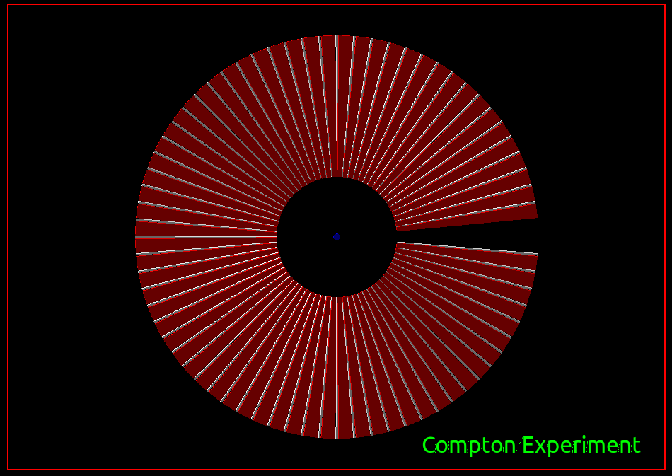
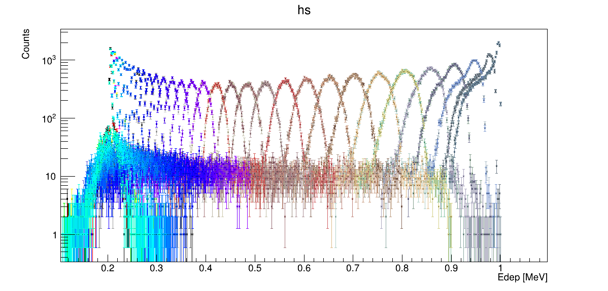
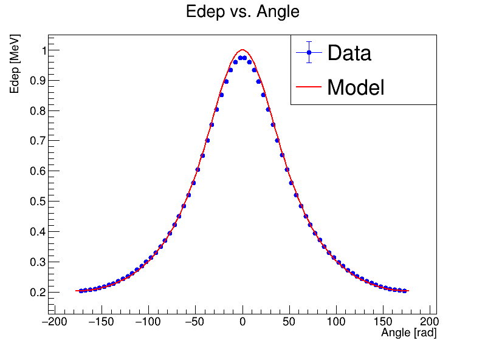

# Compton Effect experiment
Questa piattaforma Geant4 è stata creata come esercizio per poter apprenderne il funzionamento e approfondire le consoscienze sulla implementazione di nuove geometrie. 

Lo scopo di questa piattaforma consiste nell'implementare un esperimento per la verifica dell' **Effetto Compton** che consistette in una delle prime evidenze sperimentali della natura cospuscolare della materia.

Data infatti una radiazione incidente, ad una data frequenza, attraverso calcoli di meccanica relativistica, si può dimostrare che l'energia del fotone di scattering è data dalla seguente equazione:

L'esperimento implementato nella simulazione Geant4 va quindi a simulare un apparato con una sorgente di fotoni puntiforme che spara ad una energia fissata dall'utente lungo una linea retta, un target ATTIVO costituito da uno scintillatore NaI(Tl) posto al centro. Lungo tutta la circonferenza vi sono invece dei rivelatori CdZnTe (CZT) intervallati da scudi di Piombo. Questi rivelatori hanno un preciso angolo di puntamento e sottendono un preciso angolo, settati entrambi dall'utente.

Nell'immagine viene schematizzato l'apparato sperimentale simulato in GEANT. In rosso vi sono i segmenti di detector, ognuno dei quali sottende un particolare angolo.
Maggiore e' il numero dei detector settato nel file myglobals.hh, minore sara' l'angolo sotteso. Maggiore sara' la precisione con cui si misura l'angolo di Compton scattering, ma maggiore sara' il tempo necessario per generare una statistica sufficiente.

Il detector infatti e' situato su un piano e, in questa geometria non consente di sfruttare al meglio la tridimensionalita'del fenomeno. Questo puo' soprattutto inficiare sulla statistica e sul tempo necessario per ottenere un numero soddisfacente di eventi.

Nella directory principale, il software geant genera un file .csv nel quale viene associato al numero identificativo del detector, l'angolo codificato. Questo e' utile perche', il file di output .root, contenente i risultati della simulazione, sono organizzati in un branch con molte foglie, ognuna delle quali e' soprannominata "Ed_xx" dove al posto di xx va sostituita l'etichetta del detector. 

Il detector presenta un'apertura da una parte per la sorgente, ovvero un fascio lineare di fotoni gamma con una energia specificata dall'utente nella macro .mac per generare la simulazione.

La macro run.mac mostra un esempio funzionante di come lavorare con questa piattaforma.

Una macro ROOT permette di analizzare i dati presenti nel root file generato e produce i grafici mostrati di seguito

Individuando massimo e rms degli istogrammi riportati si puo` andare a caratterizzare l'energia media del fotone dopo lo scattering in funzione dell'angolo di scattering.

Il modello viene riportato nell'immagine sopra dove l'energia in funzione dell'angolo e` riportata.

